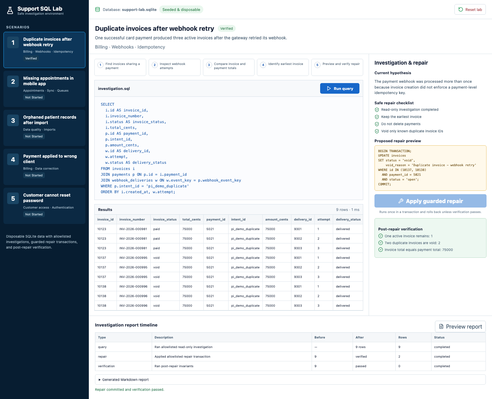
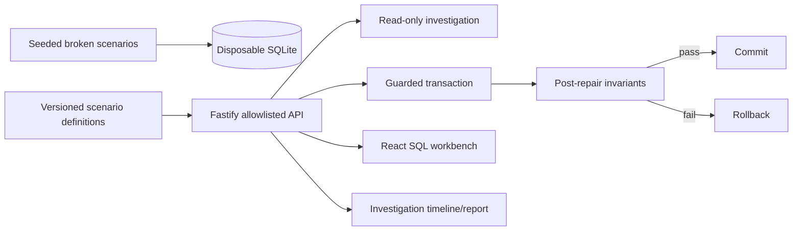

# Support SQL Lab

A disposable support investigation environment with realistic clinic, customer, integration, billing, appointment, import, and account data. Five deliberately broken scenarios include read-only SQL, guarded repair transactions, verification queries, and a generated investigation timeline.



## Problem and user context

Support engineers often need to prove what happened in data before changing it. The dangerous version of that workflow is an unrestricted production console. This project demonstrates a safer pattern:

- investigate a seeded incident with read-only SQL;
- state a hypothesis and repair constraints;
- preview a narrowly scoped transaction;
- enforce an exact affected-row count;
- roll back unless scenario-specific verification passes;
- retain before/after activity in an investigation report.

All records, identifiers, amounts, clinics, and users are synthetic.

## Scenarios

| Scenario | Domain | Safe repair |
| --- | --- | --- |
| Duplicate invoices after webhook retry | Billing, webhooks, idempotency | Void two known duplicate invoices; preserve payment and earliest invoice. |
| Missing appointments in mobile app | Appointments, sync queues | Requeue three known failed rows without changing appointment data. |
| Orphaned patient records after import | Imports, data quality | Quarantine unmatched rows; preserve source payloads. |
| Payment applied to wrong client | Billing correction | Align one known payment owner with its linked invoice. |
| Customer cannot reset password | Customer access | Unlock one synthetic user, invalidate expired tokens, issue one synthetic token. |

## Features

- SQLite schema spanning clinics, clients, payments, invoices, webhooks, integrations, appointments, patients, mappings, users, and reset tokens.
- Five documented investigation/repair/verification scripts.
- Browser workbench with SQL display, result tables, safety checklist, repair preview, and report timeline.
- No arbitrary SQL endpoint; only repository-owned scenario steps can execute.
- Transaction rollback on affected-row mismatch or failed verification.
- Generated Markdown investigation report.
- Fastify health/API surface, structured request logging, tests, CI, and responsive evidence.

## Architecture



## Data model

Core relationships:

- `clinics` own clients, integrations, appointments, and patients.
- `payments` link processor intent/event identifiers to invoices.
- `webhook_deliveries` expose retry attempts for one event key.
- `owner_mappings` identify imported patient rows with valid source owners.
- `users` and `password_reset_tokens` model account recovery without storing real credentials.
- `investigation_events` records query, repair, and verification activity.

## Setup and usage

Requirements: Node.js 20+, npm 10+, SQLite support through `better-sqlite3`, and Chromium for E2E.

```bash
npm install
npx playwright install chromium
npm run dev
```

Open `http://127.0.0.1:4473`. The API runs on `http://127.0.0.1:4474`.

```bash
npm run seed
npm test
npm run test:e2e
npm run lint
npm run typecheck
npm run build
npm run verify
npm run evidence:screenshots
```

## API safety boundary

| Method | Route | Behavior |
| --- | --- | --- |
| `GET` | `/health` | Service and disposable-database identity. |
| `GET` | `/api/scenarios` | Scenario definitions and current local status. |
| `GET` | `/api/scenarios/:id` | One scenario and its timeline. |
| `POST` | `/api/scenarios/:id/query` | Run only that scenario's read-only query. |
| `POST` | `/api/scenarios/:id/repair` | Run only that scenario's guarded transaction and verification. |
| `POST` | `/api/reset` | Recreate the disposable database. |

There is intentionally no general `/api/query` route.

## Documented SQL

- [Duplicate invoices](docs/investigations/duplicate-invoices.sql)
- [Missing appointments](docs/investigations/missing-appointments.sql)
- [Orphaned patients](docs/investigations/orphaned-patients.sql)
- [Wrong-client payment](docs/investigations/wrong-client-payment.sql)
- [Password reset](docs/investigations/password-reset.sql)

Each file separates investigation, repair, and verification phases.

## Testing

- `tests/scenarios.test.ts` checks all five definitions and applies every guarded repair to its verified invariant.
- `tests/api.test.ts` proves the allowlisted API works and an arbitrary SQL route does not exist.
- `e2e/investigation.spec.ts` runs the duplicate-invoice query, applies the repair, and confirms one active invoice remains.
- CI runs lint, type-check, unit/integration tests, production builds, and Chromium E2E.

## Operational considerations

- Production repair tools should use read replicas for investigation and require explicit authorization for writes.
- Every repair should include a maximum affected-row count and a verified rollback path.
- Avoid putting unrestricted SQL or user-provided table names into an API.
- Reports should record operator identity, database target, transaction ID, query version, and approval.
- The seeded database is disposable; these scripts must not be applied to a real database without adapting constraints and review.

See [OPERATIONS.md](docs/OPERATIONS.md).

## Evidence

- [Desktop verified repair](docs/screenshots/verified-repair-desktop.png)
- [Mobile verified repair](docs/screenshots/verified-repair-mobile.png)
- [Sample investigation report](docs/sample-investigation-report.md)
- [Verification report](docs/VERIFICATION.md)

## Limitations and future work

- SQLite is used for a self-contained portfolio demo; production syntax and locking differ by database.
- The UI executes one investigation query per scenario rather than a free-form editor.
- There is no authentication, multi-user approval, backup integration, or production connection.
- Reports are generated locally and are not exported to external systems.

## License

[MIT](LICENSE)
